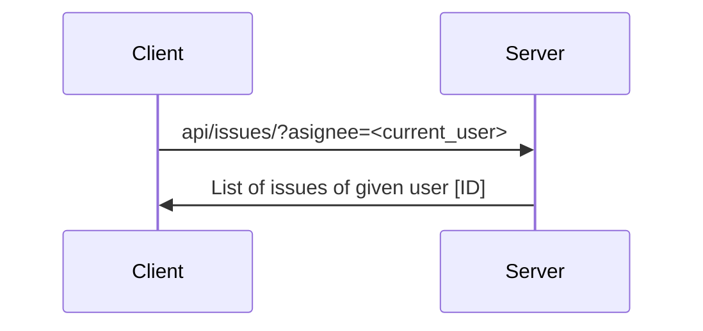

## List issues assigned to current user

```mermaid
sequenceDiagram
    participant Client
    participant Server
    Client->>Server:  api/issues/?asignee=<current_user>
    Server->>Client: List of issues of given user [ID]

```