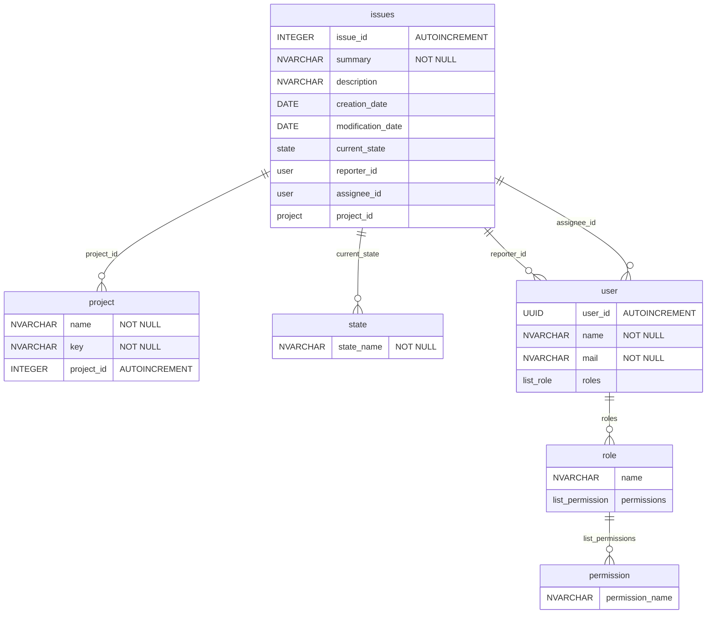

```mermaid
erDiagram

  issues {
    INTEGER issue_id "AUTOINCREMENT"
    NVARCHAR summary "NOT NULL"
    NVARCHAR description
    DATE creation_date
    DATE modification_date
    state current_state
    user reporter_id
    user assignee_id
    project project_id
  }
  
  project {
    NVARCHAR name "NOT NULL"
    NVARCHAR key "NOT NULL"
    INTEGER project_id "AUTOINCREMENT"
  }
  
  state {
    NVARCHAR state_name "NOT NULL"
  }
  
  user {
    UUID user_id "AUTOINCREMENT"
    NVARCHAR name "NOT NULL"
    NVARCHAR mail "NOT NULL"
    list_role roles
    
  }
  
  role {
    NVARCHAR name
    list_permission permissions
  }
  
  permission {
    NVARCHAR permission_name
  }
  
  
  issues ||--o{ project : "project_id"
  issues ||--o{ user : "reporter_id"
  issues ||--o{ user : "assignee_id"
  issues ||--o{ state : "current_state"
  user ||--o{ role : "roles"
  role ||--o{ permission : "list_permissions"

```
