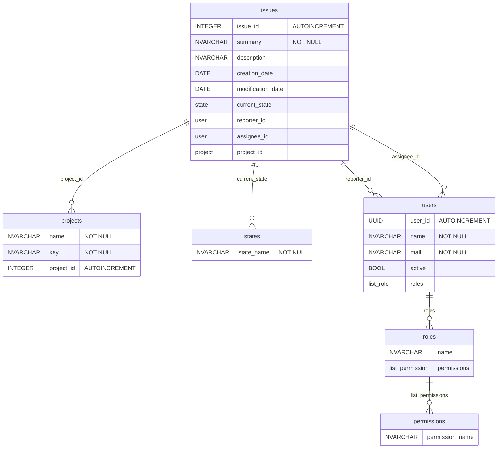

```mermaid
erDiagram

  issues {
    INTEGER issue_id "AUTOINCREMENT"
    NVARCHAR summary "NOT NULL"
    NVARCHAR description
    DATE creation_date
    DATE modification_date
    state current_state
    user reporter_id
    user assignee_id
    project project_id
  }
  
  projects {
    NVARCHAR name "NOT NULL"
    NVARCHAR key "NOT NULL"
    INTEGER project_id "AUTOINCREMENT"
  }
  
  states {
    NVARCHAR state_name "NOT NULL"
  }
  
  users {
    UUID user_id "AUTOINCREMENT"
    NVARCHAR name "NOT NULL"
    NVARCHAR mail "NOT NULL"
    BOOL active 
    list_role roles
    
  }
  
  roles {
    NVARCHAR name
    list_permission permissions
  }
  
  permissions {
    NVARCHAR permission_name
  }
  
  
  issues ||--o{ projects : "project_id"
  issues ||--o{ users : "reporter_id"
  issues ||--o{ users : "assignee_id"
  issues ||--o{ states : "current_state"
  users ||--o{ roles : "roles"
  roles ||--o{ permissions : "list_permissions"

```
