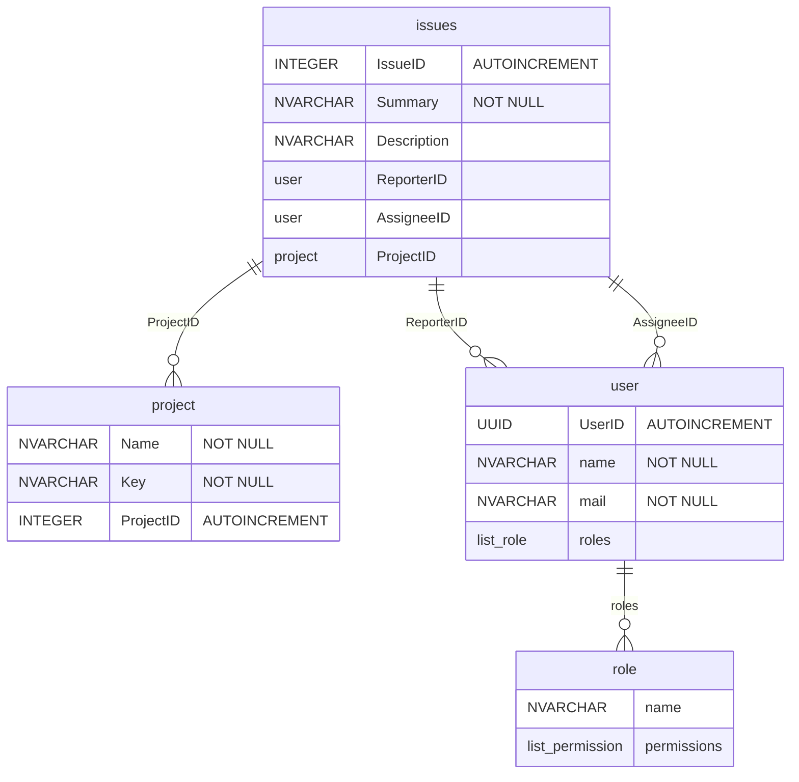

```mermaid
erDiagram

  issues {
    INTEGER IssueID "AUTOINCREMENT"
    NVARCHAR Summary "NOT NULL"
    NVARCHAR Description
    user ReporterID
    user AssigneeID
    project ProjectID
  }
  
  project {
    NVARCHAR Name "NOT NULL"
    NVARCHAR Key "NOT NULL"
    INTEGER ProjectID "AUTOINCREMENT"
  }
  
  user {
    UUID UserID "AUTOINCREMENT"
    NVARCHAR name "NOT NULL"
    NVARCHAR mail "NOT NULL"
    list_role roles
    
  }
  
  role {
    NVARCHAR name
    list_permission permissions
  }
  
  
  issues ||--o{ project : "ProjectID"
  issues ||--o{ user : "ReporterID"
  issues ||--o{ user : "AssigneeID"
  user ||--o{ role : "roles"

```
